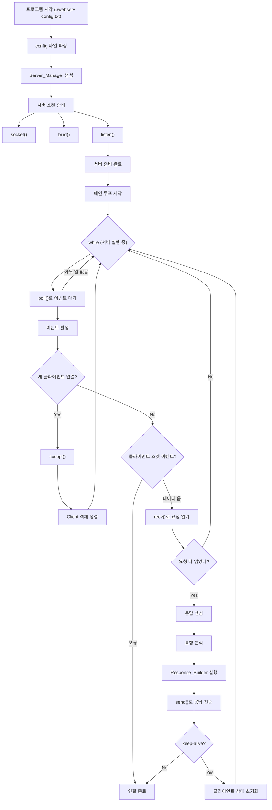

```mermaid

flowchart TD

%% ===============================
%% PROGRAM START
%% ===============================
A["프로그램 시작 (./webserv config.txt)"]
  --> B["config 파일 파싱"]
  --> C["Server_Manager 생성"]

%% ===============================
%% SERVER PREPARE
%% ===============================
C --> D["서버 소켓 준비"]
D --> D1["socket()"]
D --> D2["bind()"]
D --> D3["listen()"]
D3 --> E["서버 준비 완료"]

%% ===============================
%% MAIN LOOP
%% ===============================
E --> F["메인 루프 시작"]
F --> G{"while (서버 실행 중)"}

%% ===============================
%% WAIT
%% ===============================
G --> H["poll()로 이벤트 대기"]

H -->|아무 일 없음| G

%% ===============================
%% NEW CONNECTION
%% ===============================
H --> I["이벤트 발생"]
I --> J{새 클라이언트 연결?}

J -->|Yes| K["accept()"]
K --> K1["Client 객체 생성"]
K1 --> G

%% ===============================
%% CLIENT REQUEST
%% ===============================
J -->|No| L{"클라이언트 소켓 이벤트?"}

L -->|오류| M["연결 종료"]

L -->|데이터 옴| N["recv()로 요청 읽기"]

N --> O{"요청 다 읽었나?"}
O -->|No| G

%% ===============================
%% RESPONSE
%% ===============================
O -->|Yes| P["응답 생성"]
P --> P1["요청 분석"]
P1 --> P2["Response_Builder 실행"]
P2 --> Q["send()로 응답 전송"]

%% ===============================
%% CONNECTION DECISION
%% ===============================
Q --> R{"keep-alive?"}
R -->|Yes| S["클라이언트 상태 초기화"]
S --> G

R -->|No| M


```

