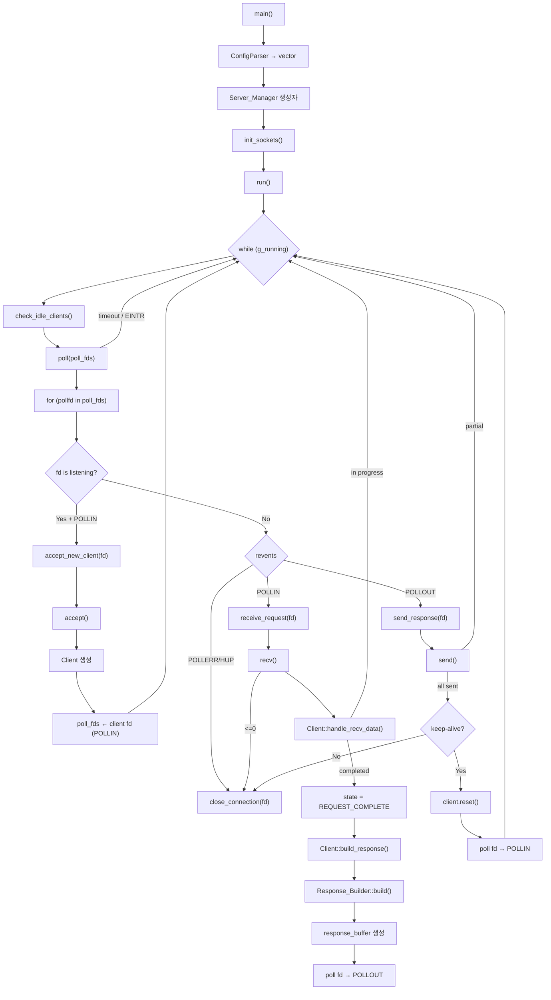

```mermaid

flowchart TD

%% =====================
%% STARTUP
%% =====================
A["main()"]
  --> B["ConfigParser → vector<Server>"]
  --> C["Server_Manager 생성자"]
  --> C1["init_sockets()"]
  --> D["run()"]

%% =====================
%% MAIN LOOP (REAL HOT PATH)
%% =====================
D --> E{"while (g_running)"}

E --> F["check_idle_clients()"]
F --> G["poll(poll_fds)"]

G -->|timeout / EINTR| E

G --> H["for (pollfd in poll_fds)"]

%% =====================
%% ACCEPT
%% =====================
H --> I{fd is listening?}

I -->|Yes + POLLIN| J["accept_new_client(fd)"]
J --> J1["accept()"]
J1 --> J2["Client 생성"]
J2 --> J3["poll_fds ← client fd (POLLIN)"]
J3 --> E

%% =====================
%% CLIENT DATA
%% =====================
I -->|No| K{revents}

K -->|POLLERR/HUP| Z["close_connection(fd)"]

K -->|POLLIN| L["receive_request(fd)"]
L --> L1["recv()"]
L1 -->|<=0| Z

L1 --> L2["Client::handle_recv_data()"]
L2 -->|in progress| E
L2 -->|completed| M["state = REQUEST_COMPLETE"]

%% =====================
%% RESPONSE BUILD
%% =====================
M --> N["Client::build_response()"]
N --> N1["Response_Builder::build()"]
N1 --> N2["response_buffer 생성"]
N2 --> N3["poll fd → POLLOUT"]

%% =====================
%% SEND
%% =====================
K -->|POLLOUT| O["send_response(fd)"]
O --> O1["send()"]
O1 -->|partial| E

O1 -->|all sent| P{keep-alive?}

P -->|Yes| Q["client.reset()"]
Q --> Q1["poll fd → POLLIN"]
Q1 --> E

P -->|No| Z


```

