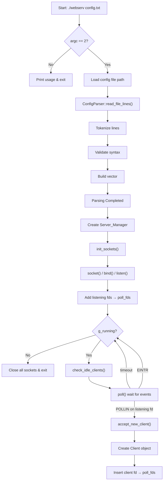

```mermaid
flowchart TD

    %% ==== PROGRAM START ====
    A["Start: ./webserv config.txt"] --> B{argc == 2?}
    B -->|No| B1["Print usage & exit"]
    B -->|Yes| C["Load config file path"]

    %% ==== PARSING ====
    C --> D["ConfigParser::read_file_lines()"]
    D --> E["Tokenize lines"]
    E --> F["Validate syntax"]
    F --> G["Build vector<Server>"]
    G --> H["Parsing Completed"]

    %% ==== SERVER INIT ====
    H --> I["Create Server_Manager"]
    I --> J["init_sockets()"]
    J --> K["socket() / bind() / listen()"]
    K --> L["Add listening fds → poll_fds"]

    %% ==== MAIN LOOP ====
    L --> M{g_running?}
    M -->|No| Z["Close all sockets & exit"]
    M -->|Yes| N["check_idle_clients()"]

    %% ==== POLL EVENTS ====
    N --> O["poll() wait for events"]
    O -->|timeout| M
    O -->|EINTR| M

    %% ==== ACCEPT NEW CLIENT ==== 
    O -->|POLLIN on listening fd| P["accept_new_client()"]
    P --> P1["Create Client object"]
    P1 --> P2["Insert client fd → poll_fds"]
```

