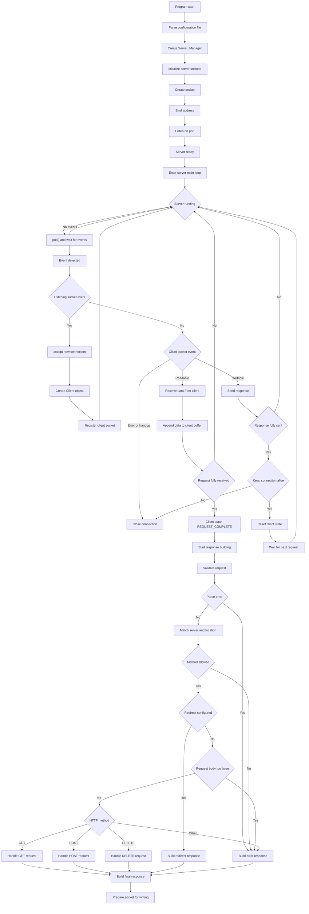

```mermaid

flowchart TD

%% =================================================
%% PROGRAM LIFECYCLE
%% =================================================
A["Program start"]
  --> B["Parse configuration file"]
  --> C["Create Server_Manager"]
  --> D["Initialize server sockets"]
  --> D1["Create socket"]
  --> D2["Bind address"]
  --> D3["Listen on port"]
  --> E["Server ready"]

%% =================================================
%% SERVER MAIN LOOP
%% =================================================
E --> F["Enter server main loop"]
F --> G{"Server running"}

G --> H["poll() and wait for events"]
H -->|No events| G

%% =================================================
%% EVENT DISPATCH
%% =================================================
H --> I["Event detected"]

I --> J{"Listening socket event"}

%% =================================================
%% ACCEPT NEW CLIENT
%% =================================================
J -->|Yes| K["accept new connection"]
K --> K1["Create Client object"]
K1 --> K2["Register client socket"]
K2 --> G

%% =================================================
%% CLIENT SOCKET EVENT
%% =================================================
J -->|No| L{"Client socket event"}

L -->|Error or hangup| Z["Close connection"]

%% =================================================
%% RECEIVE REQUEST (CLIENT LIFECYCLE)
%% =================================================
L -->|Readable| M["Receive data from client"]
M --> N["Append data to client buffer"]
N --> O{"Request fully received"}

O -->|No| G

%% =================================================
%% RESPONSE PHASE (INSIDE SERVER LOOP)
%% =================================================
O -->|Yes| P["Client state: REQUEST_COMPLETE"]
P --> Q["Start response building"]

%% -------------------------------------------------
%% RESPONSE DECISION TREE
%% -------------------------------------------------
Q --> Q1["Validate request"]
Q1 --> Q2{"Parse error"}

Q2 -->|Yes| ER["Build error response"]
Q2 -->|No| Q3["Match server and location"]

Q3 --> Q4{"Method allowed"}
Q4 -->|No| ER

Q4 -->|Yes| Q5{"Redirect configured"}
Q5 -->|Yes| RR["Build redirect response"]

Q5 -->|No| Q6{"Request body too large"}
Q6 -->|Yes| ER

%% -------------------------------------------------
%% HTTP METHOD HANDLING
%% -------------------------------------------------
Q6 -->|No| Q7{"HTTP method"}

Q7 -->|GET| G1["Handle GET request"]
Q7 -->|POST| P1["Handle POST request"]
Q7 -->|DELETE| DREQ["Handle DELETE request"]
Q7 -->|Other| ER

G1 --> R["Build final response"]
P1 --> R
DREQ --> R
RR --> R
ER --> R

%% =================================================
%% SEND RESPONSE
%% =================================================
R --> S["Prepare socket for writing"]

L -->|Writable| T["Send response"]
T --> U{"Response fully sent"}

U -->|No| G

%% =================================================
%% CONNECTION DECISION
%% =================================================
U -->|Yes| V{"Keep connection alive"}

V -->|Yes| W["Reset client state"]
W --> W1["Wait for next request"]
W1 --> G

V -->|No| Z


```

