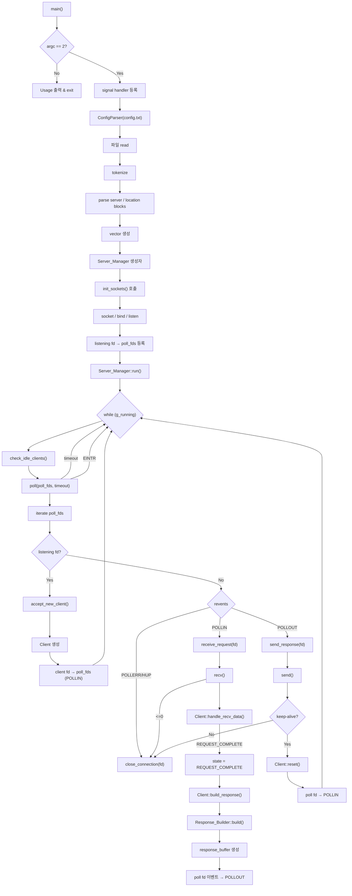

```mermaid

flowchart TD

%% ======================
%% PROGRAM ENTRY
%% ======================
A["main()"] --> B{argc == 2?}
B -->|No| B1["Usage 출력 & exit"]
B -->|Yes| C["signal handler 등록"]

C --> D["ConfigParser(config.txt)"]
D --> D1["파일 read"]
D1 --> D2["tokenize"]
D2 --> D3["parse server / location blocks"]
D3 --> E["vector<Server> 생성"]

%% ======================
%% SERVER_MANAGER LIFECYCLE
%% ======================
E --> F["Server_Manager 생성자"]
F --> F1["init_sockets() 호출"]
F1 --> F2["socket / bind / listen"]
F2 --> F3["listening fd → poll_fds 등록"]
F3 --> G["Server_Manager::run()"]

%% ======================
%% MAIN LOOP
%% ======================
G --> H{"while (g_running)"}
H --> I["check_idle_clients()"]
I --> J["poll(poll_fds, timeout)"]

J -->|timeout| H
J -->|EINTR| H

J --> K["iterate poll_fds"]

%% ======================
%% NEW CONNECTION
%% ======================
K --> L{listening fd?}
L -->|Yes| M["accept_new_client()"]
M --> M1["Client 생성"]
M1 --> M2["client fd → poll_fds (POLLIN)"]
M2 --> H

%% ======================
%% CLIENT SOCKET
%% ======================
L -->|No| N{revents}

N -->|POLLERR/HUP| O["close_connection(fd)"]

N -->|POLLIN| P["receive_request(fd)"]
P --> P1["recv()"]
P1 -->|<=0| O

P1 --> P2["Client::handle_recv_data()"]
P2 -->|REQUEST_COMPLETE| Q["state = REQUEST_COMPLETE"]

%% ======================
%% RESPONSE BUILD
%% ======================
Q --> R["Client::build_response()"]
R --> R1["Response_Builder::build()"]
R1 --> R2["response_buffer 생성"]
R2 --> R3["poll fd 이벤트 → POLLOUT"]

%% ======================
%% SEND
%% ======================
N -->|POLLOUT| S["send_response(fd)"]
S --> S1["send()"]
S1 --> S2{keep-alive?}

S2 -->|Yes| T["Client::reset()"]
T --> T1["poll fd → POLLIN"]
T1 --> H

S2 -->|No| O


```

