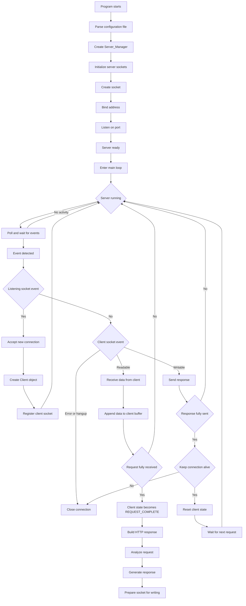

```mermaid


flowchart TD

%% ===============================
%% PROGRAM STARTUP
%% ===============================
A["Program starts"]
  --> B["Parse configuration file"]
  --> C["Create Server_Manager"]

%% ===============================
%% SERVER INITIALIZATION
%% ===============================
C --> D["Initialize server sockets"]
D --> D1["Create socket"]
D1 --> D2["Bind address"]
D2 --> D3["Listen on port"]
D3 --> E["Server ready"]

%% ===============================
%% MAIN EVENT LOOP
%% ===============================
E --> F["Enter main loop"]
F --> G{"Server running"}

G --> H["Poll and wait for events"]

H -->|No activity| G

%% ===============================
%% EVENT DISPATCH
%% ===============================
H --> I["Event detected"]
I --> J{"Listening socket event"}

%% ===============================
%% NEW CLIENT CONNECTION
%% ===============================
J -->|Yes| K["Accept new connection"]
K --> K1["Create Client object"]
K1 --> K2["Register client socket"]
K2 --> G

%% ===============================
%% CLIENT SOCKET EVENT
%% ===============================
J -->|No| L{"Client socket event"}

L -->|Error or hangup| X["Close connection"]

%% ===============================
%% RECEIVE REQUEST
%% ===============================
L -->|Readable| M["Receive data from client"]
M --> N["Append data to client buffer"]
N --> O{"Request fully received"}

O -->|No| G

%% ===============================
%% REQUEST COMPLETE
%% ===============================
O -->|Yes| P["Client state becomes REQUEST_COMPLETE"]
P --> Q["Build HTTP response"]
Q --> Q1["Analyze request"]
Q1 --> Q2["Generate response"]
Q2 --> R["Prepare socket for writing"]

%% ===============================
%% SEND RESPONSE
%% ===============================
L -->|Writable| S["Send response"]
S --> T{"Response fully sent"}

T -->|No| G

%% ===============================
%% CONNECTION DECISION
%% ===============================
T -->|Yes| U{"Keep connection alive"}

U -->|Yes| V["Reset client state"]
V --> V1["Wait for next request"]
V1 --> G

U -->|No| X


```

