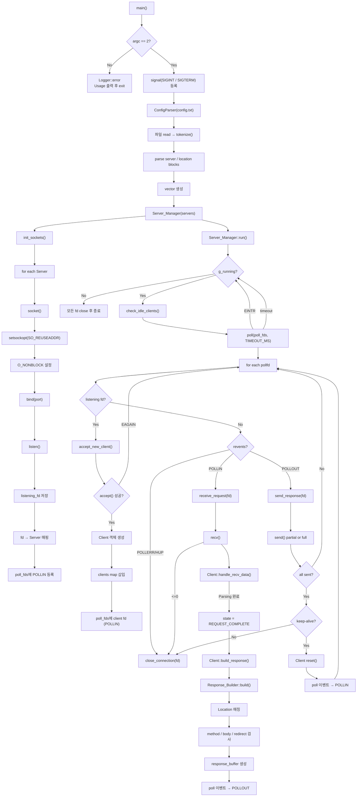

```mermaid

flowchart TD

%% ======================
%% PROGRAM ENTRY
%% ======================
A["main()"] --> B{argc == 2?}
B -->|No| B1["Logger::error\nUsage 출력 후 exit"]
B -->|Yes| C["signal(SIGINT / SIGTERM) 등록"]

C --> D["ConfigParser(config.txt)"]
D --> D1["파일 read → tokenize()"]
D1 --> D2["parse server / location blocks"]
D2 --> E["vector<Server> 생성"]

%% ======================
%% SERVER INIT
%% ======================
E --> F["Server_Manager(servers)"]
F --> F1["init_sockets()"]

F1 --> G["for each Server"]
G --> G1["socket()"]
G1 --> G2["setsockopt(SO_REUSEADDR)"]
G2 --> G3["O_NONBLOCK 설정"]
G3 --> G4["bind(port)"]
G4 --> G5["listen()"]

G5 --> G6["listening_fd 저장"]
G6 --> G7["fd → Server 매핑"]
G7 --> G8["poll_fds에 POLLIN 등록"]

%% ======================
%% MAIN LOOP
%% ======================
F --> H["Server_Manager::run()"]
H --> I{g_running?}
I -->|No| Z["모든 fd close 후 종료"]

I -->|Yes| J["check_idle_clients()"]
J --> K["poll(poll_fds, TIMEOUT_MS)"]

K -->|EINTR| I
K -->|timeout| I

%% ======================
%% POLL EVENTS
%% ======================
K --> L["for each pollfd"]

L --> M{listening fd?}
M -->|Yes| N["accept_new_client()"]
N --> N1{"accept() 성공?"}
N1 -->|EAGAIN| L
N1 -->|Yes| N2["Client 객체 생성"]
N2 --> N3["clients map 삽입"]
N3 --> N4["poll_fds에 client fd (POLLIN)"]

M -->|No| O{revents?}

%% ======================
%% CLIENT EVENTS
%% ======================
O -->|POLLERR/HUP| P["close_connection(fd)"]

O -->|POLLIN| Q["receive_request(fd)"]
Q --> Q1["recv()"]
Q1 -->|<=0| P

Q1 --> Q2["Client::handle_recv_data()"]
Q2 -->|Parsing 완료| Q3["state = REQUEST_COMPLETE"]

%% ======================
%% BUILD RESPONSE
%% ======================
Q3 --> R["Client::build_response()"]
R --> R1["Response_Builder::build()"]
R1 --> R2["Location 매칭"]
R2 --> R3["method / body / redirect 검사"]
R3 --> R4["response_buffer 생성"]

R4 --> R5["poll 이벤트 → POLLOUT"]

%% ======================
%% SEND RESPONSE
%% ======================
O -->|POLLOUT| S["send_response(fd)"]
S --> S1["send() partial or full"]
S1 --> S2{all sent?}

S2 -->|No| L
S2 -->|Yes| T{keep-alive?}

T -->|Yes| U["Client reset()"]
U --> U1["poll 이벤트 → POLLIN"]
U1 --> L

T -->|No| P

```

