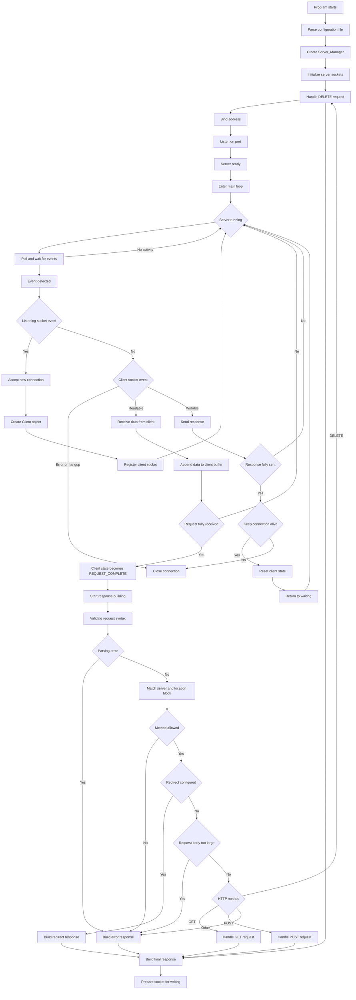

```mermaid

flowchart TD

%% ===============================
%% PROGRAM STARTUP
%% ===============================
A["Program starts"]
  --> B["Parse configuration file"]
  --> C["Create Server_Manager"]

%% ===============================
%% SERVER INITIALIZATION
%% ===============================
C --> D["Initialize server sockets"]
D --> D1["Create socket"]
D1 --> D2["Bind address"]
D2 --> D3["Listen on port"]
D3 --> E["Server ready"]

%% ===============================
%% MAIN EVENT LOOP
%% ===============================
E --> F["Enter main loop"]
F --> G{"Server running"}

G --> H["Poll and wait for events"]

H -->|No activity| G

%% ===============================
%% EVENT DISPATCH
%% ===============================
H --> I["Event detected"]
I --> J{"Listening socket event"}

%% ===============================
%% NEW CLIENT CONNECTION
%% ===============================
J -->|Yes| K["Accept new connection"]
K --> K1["Create Client object"]
K1 --> K2["Register client socket"]
K2 --> G

%% ===============================
%% CLIENT SOCKET EVENT
%% ===============================
J -->|No| L{"Client socket event"}

L -->|Error or hangup| X["Close connection"]

%% ===============================
%% RECEIVE REQUEST
%% ===============================
L -->|Readable| M["Receive data from client"]
M --> N["Append data to client buffer"]
N --> O{"Request fully received"}

O -->|No| G

%% ===============================
%% REQUEST COMPLETE
%% ===============================
O -->|Yes| P["Client state becomes REQUEST_COMPLETE"]

%% ===============================
%% RESPONSE DECISION
%% ===============================
P --> R["Start response building"]
R --> R1["Validate request syntax"]
R1 --> R2{"Parsing error"}

R2 -->|Yes| ER["Build error response"]
R2 -->|No| R3["Match server and location block"]

R3 --> R4{"Method allowed"}

R4 -->|No| ER

R4 -->|Yes| R5{"Redirect configured"}

R5 -->|Yes| RR["Build redirect response"]
R5 -->|No| R6{"Request body too large"}

R6 -->|Yes| ER

%% ===============================
%% METHOD HANDLING
%% ===============================
R6 -->|No| R7{"HTTP method"}

R7 -->|GET| G1["Handle GET request"]
R7 -->|POST| P1["Handle POST request"]
R7 -->|DELETE| D1["Handle DELETE request"]
R7 -->|Other| ER

G1 --> R8["Build final response"]
P1 --> R8
D1 --> R8
RR --> R8
ER --> R8

R8 --> R9["Prepare socket for writing"]

%% ===============================
%% SEND RESPONSE
%% ===============================
L -->|Writable| S["Send response"]
S --> T{"Response fully sent"}

T -->|No| G

%% ===============================
%% CONNECTION DECISION
%% ===============================
T -->|Yes| U{"Keep connection alive"}

U -->|Yes| V["Reset client state"]
V --> V1["Return to waiting"]
V1 --> G

U -->|No| X


```

